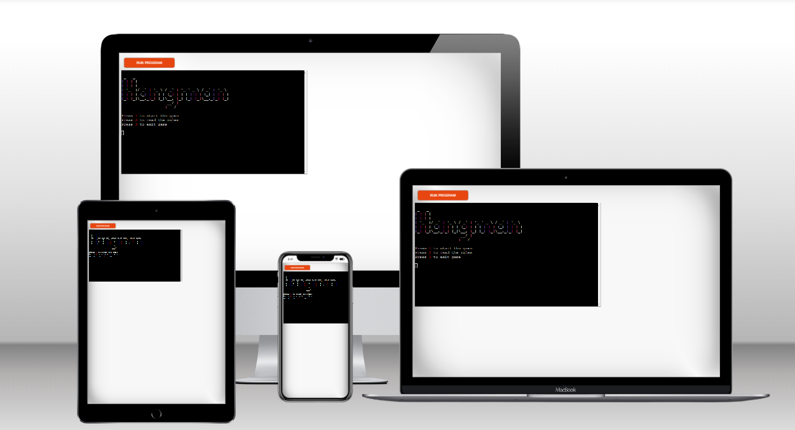
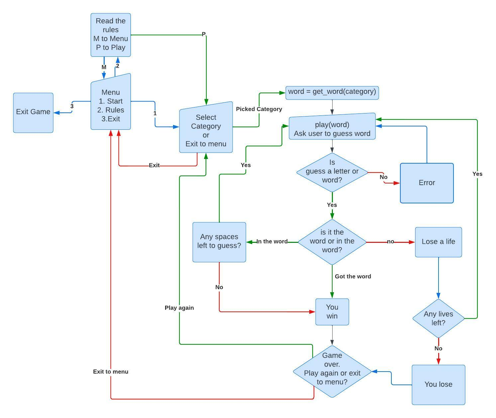
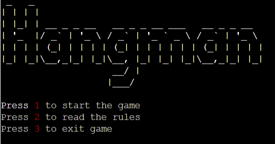
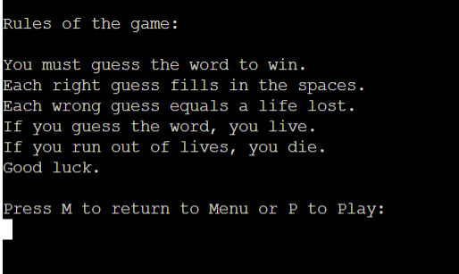
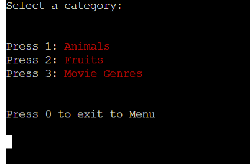
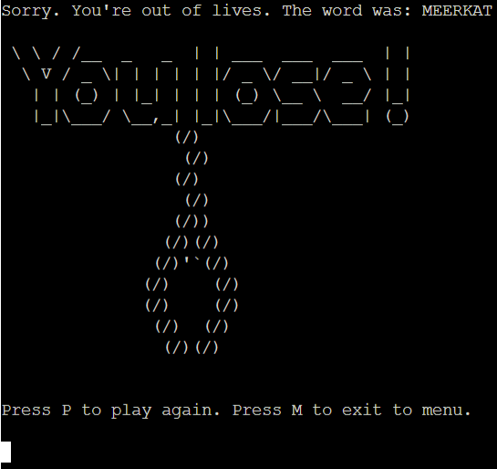
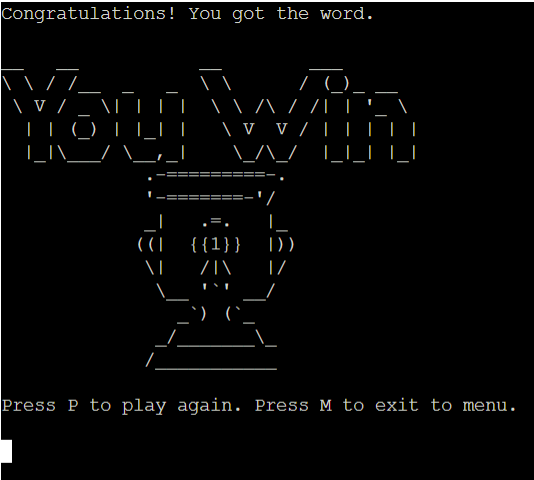
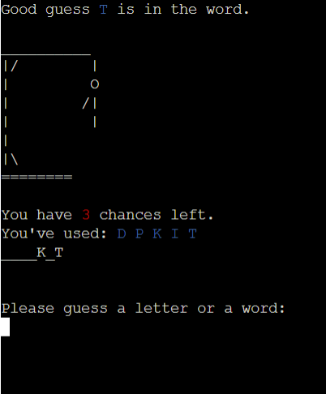
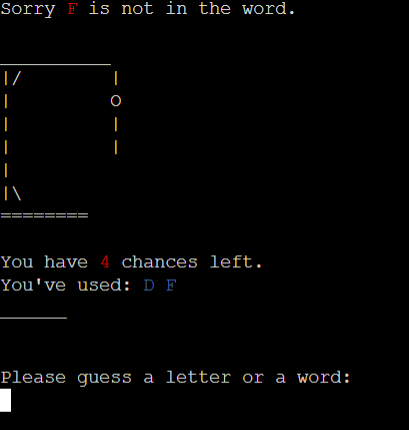

# Python Hangman

Python Hangman is a python terminal based game of Hangman. The player is presented with a hidden word and must fill in the blanks and guess the word before they run out of attempts and the stick figure is hung, signalling game over.

The live website, hosted on Code Institute mock terminal can be visited [here](https://python-hngmn.herokuapp.com/).

## How to Play

This python hangman game operates with the standard rules of the classic pen and paper game. You can read more about it [here](https://en.wikipedia.org/wiki/Hangman_(game)).

The player is presented with blank spaces representing a word they must guess.

Each right guess fills in a blank.

Each wrong guess loses a life and adds a piece to the hangman image.

If the player guesses the word before running out of lives, they win.

If the player is out of lives before guessing the word and the hangman image is completed, they lose.

### Planning Stage

## User Experience (UX)
This game should appeal to all ages, from kids to adults who enjoy puzzle games.
* User should:
    * clearly understand the rules of the game
    * experience a fun but challenging game
    * understand the prompts as they play through
    * clearly understand how they are progressing as indicated by spaces filled and lives left.

## Flowchart
The flowchart is used to design the way in which the  individual statements, instructions or function calls were executed or evaluated. This aided in design as it gave a visual representationg of how the game should flow and where statements such as if-else statements or while loops were needed.

## Features

* Game Menu
    * User is welcomed with a game menu and options for how they would like to proceed.
    * This is a standard feature for games and is the most acceptable way of welcoming a player to a game. They can chose to start the game, read the rules or exit entirely.

* Rules 
    * If the user choses to view the rules they will be presented to them.
    * This adds to the user experience as the user should clearly undeerstand the rules of the game in order to fully enjoy their gameplay experience.

* Category selection
    * When a player choses to start the game they are taken to a category selection menus where they can chose which category odf words they would like to play.
    * This gives the player another level of customizability to their gameplay experience as each category generates a random word from its own list of words.

* Win or Lose
    * If the word is guessed, the player wins. If they run out of lives they lose. This outcome is displayed to them on screen.
    * This visual display clearly lets the player know the outcome of the game. a classic "You win" or "You lose" is a staple of video games, one every player will be familiar with.

* Game
    * The game itself is a standard game of hangman, the player is prompted to make guesses and it is indicated to them weather they've made a right or wrong guess.
    * The gameplay display appropriately lets the user know how they are progressing as they play.

### libraries and technologies uses
imports - used for --

## user testing input 
categories print statement should be added.

