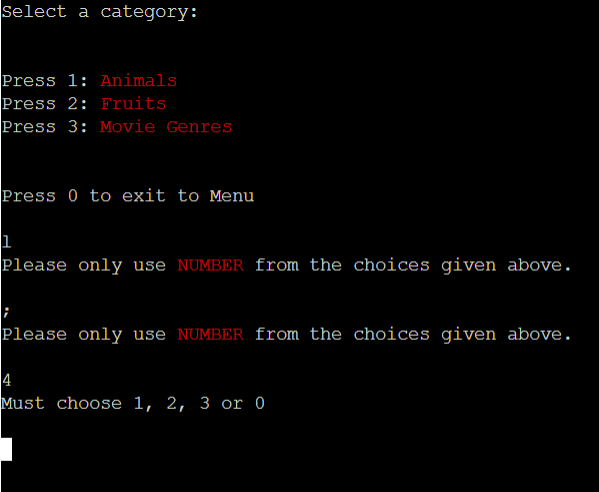

# Python Hangman

Python Hangman is a python terminal based game of Hangman. The player is presented with a hidden word and must fill in the blanks and guess the word before they run out of attempts and the stick figure is hung, signalling game over.

The live website, hosted on Code Institute mock terminal can be visited [here](https://python-hngmn.herokuapp.com/).

## How to Play

This python hangman game operates with the standard rules of the classic pen and paper game. You can read more about it [here](https://en.wikipedia.org/wiki/Hangman_(game)).

The player is presented with blank spaces representing a word they must guess.

Each right guess fills in a blank.

Each wrong guess loses a life and adds a piece to the hangman image.

If the player guesses the word before running out of lives, they win.

If the player is out of lives before guessing the word and the hangman image is completed, they lose.

### Planning Stage

## User Experience (UX)
This game should appeal to all ages, from kids to adults who enjoy puzzle games.
* User should:
    * clearly understand the rules of the game
    * experience a fun but challenging game
    * understand the prompts as they play through
    * clearly understand how they are progressing as indicated by spaces filled and lives left.

## Flowchart
The flowchart is used to design the way in which the  individual statements, instructions or function calls were executed or evaluated. This aided in design as it gave a visual representationg of how the game should flow and where statements such as if-else statements or while loops were needed.

## Features

* Game Menu
    * User is welcomed with a game menu and options for how they would like to proceed.
    * This is a standard feature for games and is the most acceptable way of welcoming a player to a game. They can chose to start the game, read the rules or exit entirely.

* Rules 
    * If the user choses to view the rules they will be presented to them.
    * This adds to the user experience as the user should clearly undeerstand the rules of the game in order to fully enjoy their gameplay experience.

* Category selection
    * When a player choses to start the game they are taken to a category selection menus where they can chose which category odf words they would like to play.
    * This gives the player another level of customizability to their gameplay experience as each category generates a random word from its own list of words.

* Win or Lose
    * If the word is guessed, the player wins. If they run out of lives they lose. This outcome is displayed to them on screen.
    * This visual display clearly lets the player know the outcome of the game. a classic "You win" or "You lose" is a staple of video games, one every player will be familiar with.

* Game
    * The game itself is a standard game of hangman, the player is prompted to make guesses and it is indicated to them weather they've made a right or wrong guess.
    * The gameplay display appropriately lets the user know how they are progressing as they play.

* User input validation and feedback
    * At each point of input there is validation in place to make sure only prompted inputs are accepted.
    * If the user makes an incorrect input they are prompted to make appropriate inputs only.

## Libraries and technologies uses
### Built-in Python Libraries
* random

The random library was imported to access the built-in method of generating a random selection using the random.choice. This then is used to pick a random number from the list of the selected category.
* os

The os library was imported to create a function to utilise the os.system to clear the terminal. This supports a positive user experience on game replay by clearing the previous gameplay and making the screen clearer and more structured.

* sys

The sys library was imported in order to use the sys.exit method to exit the program if the player chose to exit the game entirely when prompted.

### Others
[Colorama](https://www.pythonpool.com/python-colorama/) was used to add color to the text.

[LucidCharts](https://www.lucidchart.com/pages/) was used to create the flow diagram

[ASCII Art](https://ascii.co.uk/art) and [ASCII Text generator](https://patorjk.com/software/taag/#p=display&f=Standard&t=Type%20Something%20) for all ASCII displays

## Testing
I manually tested the project using the following methods:

* Tested python code through a PEP8 Linter and fixed any errors. The website pep8online.com was down at the time of testing, so as a workaround, I addeda PEP8 validator to my Gitpod Workspace directly by following these steps:
    * Run the command pip3 install pycodestyle  Note that this extension may already be installed, in which case this command will do nothing.
    * In your workspace, press Ctrl+Shift+P (or Cmd+Shift+P on Mac).
    * Type the word linter into the search bar that appears, and click on Python: Select Linter from the filtered results.
    * Select pycodestyle from the list.
    * PEP8 errors will now be underlined in red, as well as being listed in the PROBLEMS tab beside your terminal.

* Manually tested user inputs by purposefully inputing incorrect data to confirm error messages were capturing wrong inputs.
* Manually tested for random word selection, lives display update and blank spaces update by playing throuhg the game several times
* User testing implementd by having friends and my girlfriend play the game and give any input on features or bugs.
* Tested in the local terminal and on the mock terminal on the deployed site on Heroku.

## Bugs

* During development I had an issue with the hangman display not updating with each guess. On further inspection of the code I realused I had incorrectly indented it into the ebove if else stament. Takimg it out solved this issue.

No Bugs remaining

## Validation
* PEP8
No errors were returned from PEP8 testing i Gitpod Terminal.

## Deployment
The site was deployed via [Heroku](https://dashboard.heroku.com/apps), and the live link can be found here: https://python-hngmn.herokuapp.com/

This project was developed utilising the Code Institute Template. Some of the deployment steps below are specifically required for the new CI template and may not be applicable to older versions, or different projects.

Before deploying to Heroku pip3 freeze > requirements.txt was used to add Colorama imports for deployment.

* Log in to Heroku or create an account if required.

* Then, click the button labelled New from the dashboard in the top right corner and from the drop-down menu select Create New App.

* You must enter a unique app name, (I used mastermind-code-breaker).

* Next, select your region, (I chose Europe as I am in Ireland).

* Click on the Create App button.

* The next page you will see is the project’s Deploy Tab. Click on the Settings Tab and scroll down to Config Vars.

* Click Reveal Config Vars and enter PORT into the Key box and 8000 into the Value box and click the Add button.

* Next, scroll down to the Buildpack section click Add Buildpack select python and click Save Changes.

* Repeat step 8 to add node.js. o Note: The Buildpacks must be in the correct order. If not click and drag them to move into the correct order.

* Scroll to the top of the page and now choose the Deploy tab.

* Select Github as the deployment method.

* Confirm you want to connect to GitHub.

* Search for the repository name and click the connect button.

* Scroll to the bottom of the deploy page and select preferred deployment type:

* Click either Enable Automatic Deploys for automatic deployment when you push updates to Github.

* Select the correct branch for deployment from the drop-down menu and click Deploy Branch for manual deployment.

## Credits
### Some helpful tutorials below:

This [video](https://www.youtube.com/watch?v=cJJTnI22IF8&t=578s&ab_channel=KylieYing) that helped get the basic idea for coding the game from.

This [video](https://www.youtube.com/watch?v=m4nEnsavl6w&t=314s&ab_channel=Kite) that built on my knowledge and developed concepts further for me. This also provided the graphics for the hanging stickman.

This thread on [Stack Overflow](https://stackoverflow.com/questions/22108683/how-to-clear-cmd-terminal-while-running-a-python-script) that helped with the clear screen method.

Everything on [W3Schools](https://www.w3schools.com/python/) that came in handy to teach me and refresh me on a lot of stuff. Specifically the one on [Try Except](https://www.w3schools.com/python/python_try_except.asp) and this on [upper()](https://www.w3schools.com/python/ref_string_upper.asp).

### Some design features I came across that helped with the display of the game:

[Colorama](https://www.pythonpool.com/python-colorama/) was used to add color to the text.

[LucidCharts](https://www.lucidchart.com/pages/) was used to create the flow diagram.

[ASCII Art](https://ascii.co.uk/art) and [ASCII Text generator](https://patorjk.com/software/taag/#p=display&f=Standard&t=Type%20Something%20) for all ASCII displays.

### other:

[Code Institute](https://learn.codeinstitute.net/dashboard) for the mock terminal for the deploy to a live site.

